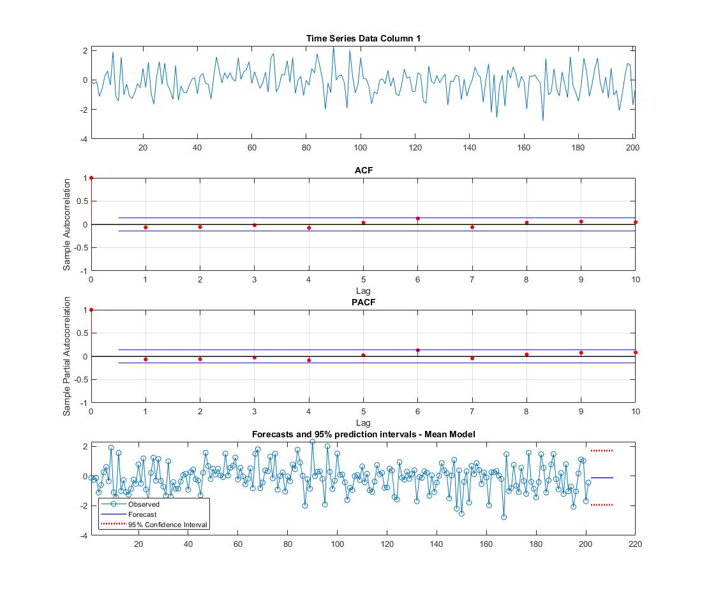

# TimeStonks ⌛💰

## Overview

This MATLAB project is designed to analyze and visualize time series data. It includes various functions and scripts for data import, statistical analysis, and visualization of different aspects of stochastic processes 📈📉

<p align="center">
   
</p>

## Prerequisites

- MATLAB installed on your computer.
- git installed. if you have mac, git is aleady installed; else if windows, please install Git. [(view steps below).](#git-installation-guide) 
## Getting Started

1. Clone this repository to your local machine:

    ```bash
    git clone https://github.com/williammcmp/TimeStonks.git
    ```

2. Open MATLAB and navigate to the project folder.

## Usage

1. Open the `main.m` script in MATLAB.

2. Edit the `folderPath` variable to specify the directory where your AFL data is stored.

3. Run the script in MATLAB to execute the desired analysis and generate visualizations.

## Git Installation Guide

### Introduction

This guide will help you install Git on your computer. Git is a powerful version control system used to track changes in software development projects.

### Installation Steps

#### Windows

1. Download Git for Windows from [https://git-scm.com/download/win](https://git-scm.com/download/win).

2. Run the downloaded installer.

3. Follow the on-screen instructions, leaving all options at their default settings unless you have a specific reason to change them.

#### macOS

1. Download Git for macOS from [https://git-scm.com/download/mac](https://git-scm.com/download/mac).

2. Run the downloaded installer package (it has a `.pkg` extension).

3. Follow the installation prompts. You may need to enter your password to complete the installation.

#### Linux (Ubuntu as an example)

1. Open your terminal.

2. Install Git using the package manager for your distribution. For Ubuntu, you can use `apt`:

   ```bash
   sudo apt update
   sudo apt install git
   ```

### Verification

To verify that Git is installed correctly, open your terminal or command prompt and run:

```bash
git --version
```

You should see the Git version information, confirming a successful installation.

### Configuration

After installing Git, configure your name and email:

```bash
git config --global user.name "Your Name"
git config --global user.email "your.email@example.com"
```

Replace "Your Name" and "your.email@example.com" with your own information.

### Getting Started

You're now ready to use Git for version control in your projects. Start by creating a new repository or cloning an existing one. Refer to Git documentation and tutorials for further guidance.

### Additional Resources

- [Official Git Documentation](https://git-scm.com/doc)
- [GitHub Learning Lab](https://lab.github.com/)
- [Atlassian Git Tutorials](https://www.atlassian.com/git/tutorials)
- [Git and GitHub for Beginners](https://guides.github.com/activities/hello-world/)

This README includes simplified installation instructions for Windows, macOS, and Linux, along with configuration steps and additional resources. 

## Contributing

Contributions to this project are welcome. Feel free to open issues, suggest improvements, or submit pull requests to enhance the functionality or documentation.

## License

This project is licensed under the MIT License. See the [LICENSE](/LICENSE) file for details.